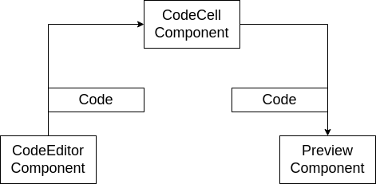

# Browser Based CLI
This is a CLI built on a package-based architecture to launch an interactive development environment for writing and documenting Code

## Features
1. In-Browser code Transpiling and Processing
2. Security against Potential security exploits.
3. Enables safe execution of User-provided code directly in the Browser
4. Launches and runs a Code Editor directlly in the browser (Same editor to VS Code's)
5. Leverages Web Assembly to run a code bundler directly in the Browser

## App Structure 

## Challenges
1. Code will be provided to PreviewComponent as a String and needs to be executed safely
2. The code might have advanced JS syntax(e.g JSX) in it that the browser can't execute
3. The code might have import statements for other JS Files or CSS, which have to be dealt with before executing the code

## Remote Vs Local Bundling/Transpiling
**Remote**
1. Can cache doownloaded NPM moduless to bundle code fatser
2. Works better for users with slow devices or limited internet connections.

**Local**
1. Removes an extra request to the API aserver - Faster Code Execution
2. No need to maintain an API Server
3. Less complexity - no moving code back and forth

**Local Bundling Solution**

Using **ESBuild** for both code transpiling and bundling

**Bundling Process**

